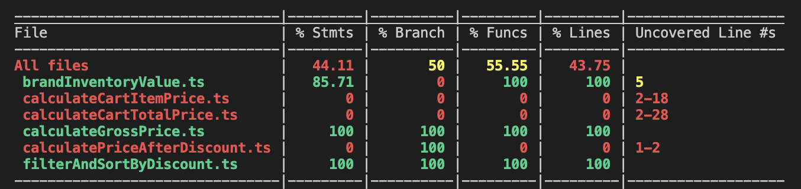
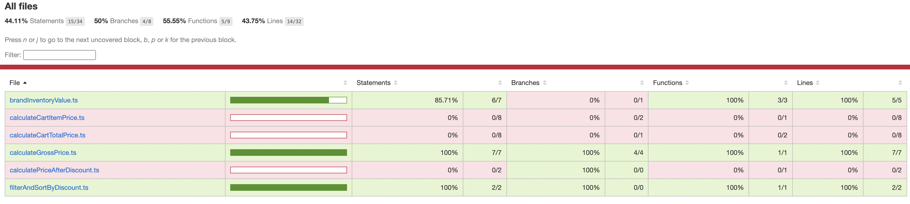
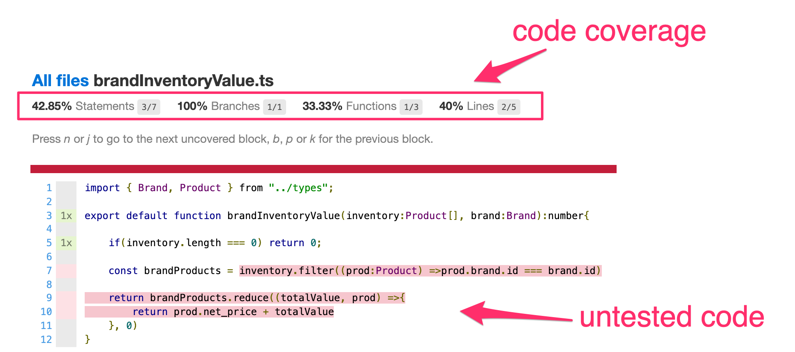
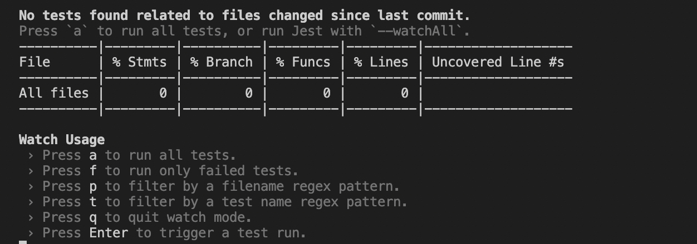
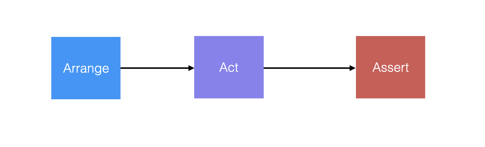

# Action Item: Unit Testing 🔬
In this **Action Item**, you will:
- :gear: write effective `unit tests` following the `AAA pattern`
- 🕵️ learn how to use `code coverage` to measure your testing progress
- :vertical_traffic_light: get introduced to `Test-Driven Development` and write tests before you write code

**Note: The difficulty increases gradually, and we recommend you complete the items in the given order.**


------
### :notebook_with_decorative_cover:Tips for effective test writing:

1. It is ok to repeat yourself(forget **DRY**) and be **DAMP**(Descriptive and Meaningfully Phrases)
2. Write clear error messages: **Given -> When -> Then**
3. Be concise: a test should contain all the information it needs, not more, not less
------

### 1.`EASY` Write a simple unit test 
Test a single function in isolation using a `unit test`.

##### 1.1 Install dependencies:
```bash
npm install
```
##### 1.2 Run the tests:
```bash
npm test
```
Check the terminal and inspect the results.
##### 1.3 :mag: Inspect the code coverage
The tests will now run when you change your code. You should also see the current **Code Coverage**:

#####  Check the coverage folder and open the [coverage/lcov-report/index.html](coverage/lcov-report/index.html) file in your browser. You should see something like this:



Code Coverage for a specific function:


##### 1.3 Complete the missing tests:

Follow the examples in then tests files:

- [calculateGrossPrice.spec.ts](src/tests/calculateGrossPrice.spec.ts)
- [brandInventoryValue.spec.ts](src/tests/brandInventoryValue.spec.ts)

Run the tests in `watch` mode:
```bash
npm run test:dev
```
You should see something like this:


Press **a** to run all the tests. Keep them running as you code to get real-time feedback on your progress.
  
##### TODO's:
- 📝 Complete the tests for [brandInventoryValue.ts](src/priceCalculator/brandInventoryValue.ts) to get the code coverage to `100%` for this function
- 📝 Add tests for [calculatePriceAfterDiscount.ts](src/priceCalculator/calculatePriceAfterDiscount.ts) and get the coverage to 100% for this function  

**HINT: Use the AAA pattern to structure your tests**


------

### 2.`MEDIUM` Write complex unit tests

##### TODO's:
- 📝 Add tests for [src/calculator/productListFilter.ts](src/filterFunctions/productListFilter.ts) and get the coverage to 100% for this function  


Note: We have added some `mock` objects to make it easier for you in [mocksExample.ts](src/tests/mocksExample.ts).

------

### 3.`MEDIUM` Add the missing function, in a `TDD` style

Use `Test-Driven Development` to implement a method. We have already written test cases for the function, you have to write the code. 

##### TODO's:
- 📝 Complete the function in [filterAndSortByDiscount.ts](src/filterFunctions/filterAndSortByDiscount.ts/) so the test in [filterAndSortByDiscount.spec.ts](src/tests/filterAndSortByDiscount.spec.ts) pass.

------
### 4.`HARD` Test a complex function

TODO:

- 📝 Add tests for [calculateCartItemPrice.ts](src/priceCalculator/calculateCartItemPrice.ts) and get the coverage to 100% for this function

Use `jest` to [mock dependencies](https://jestjs.io/docs/mock-functions).

------

### Going above and beyond :rocket:

1. Get the code coverage as close to 100% as possible
2. Add tests to all the missing functions


### Getting Help 
If you have issues with the Action Item, you can get help and feedback in the [Community](https://community.codewithdragos.com/) or, in the [Weekly Calls](https://calendar.google.com/calendar/u/0?cid=Y19kbGVoajU1Z2prNXZmYmdoYmxtdDRvN3JyNEBncm91cC5jYWxlbmRhci5nb29nbGUuY29t).

### Made with :orange_heart: in Berlin by @CodeWithDragos
